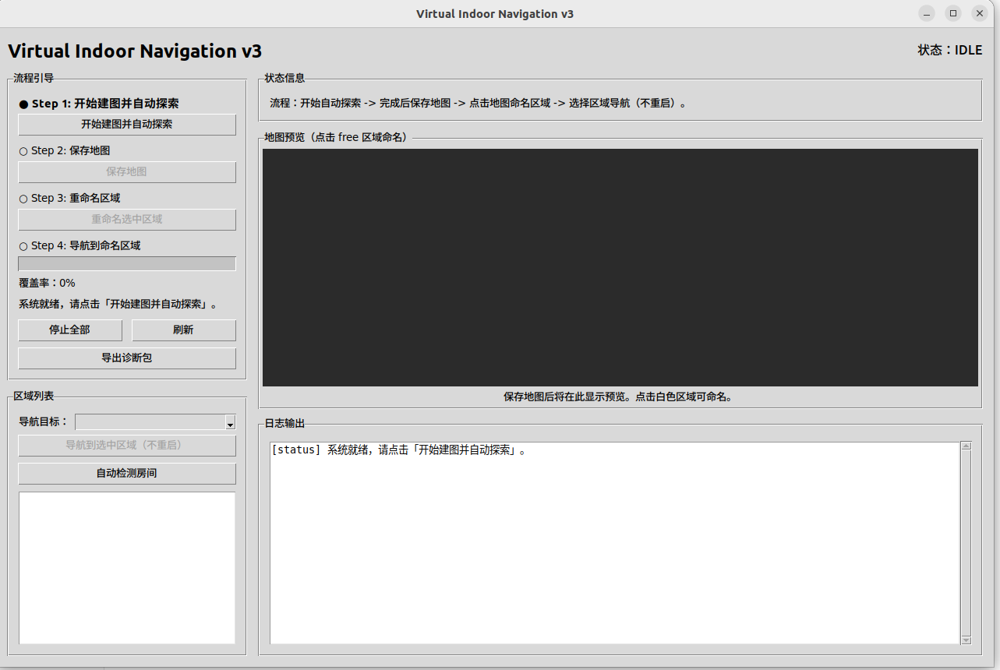
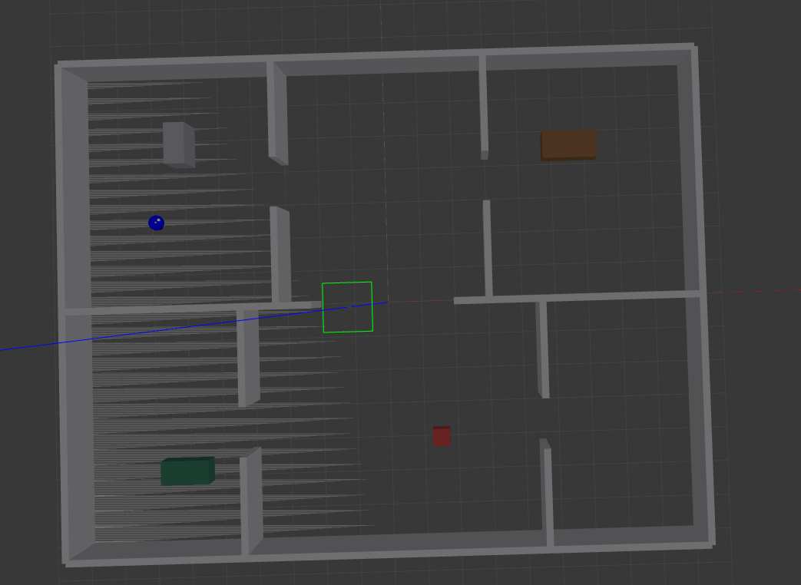
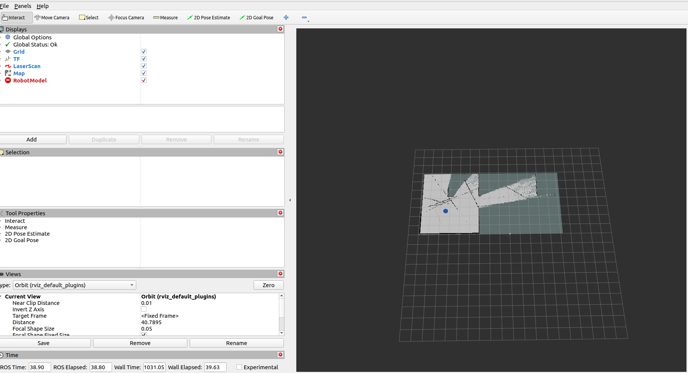
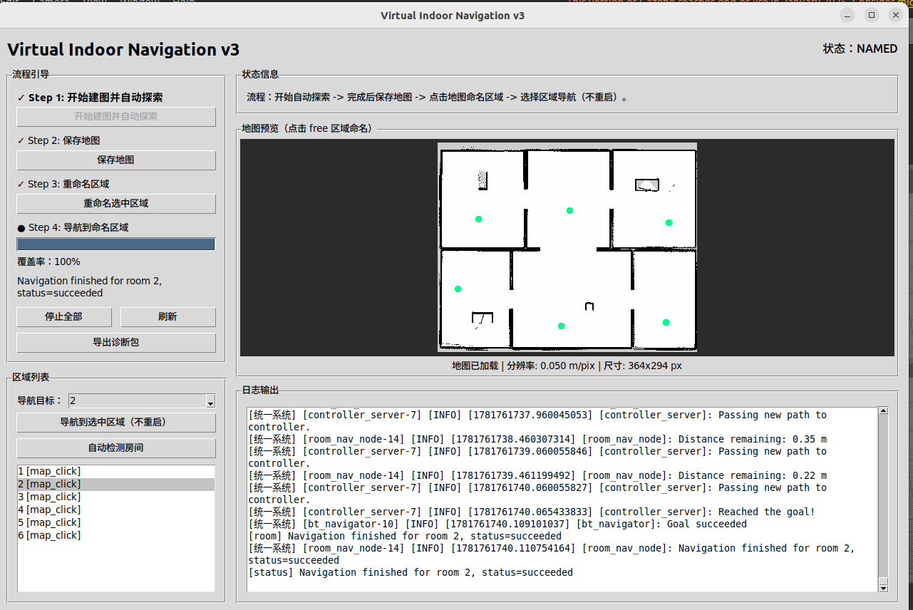
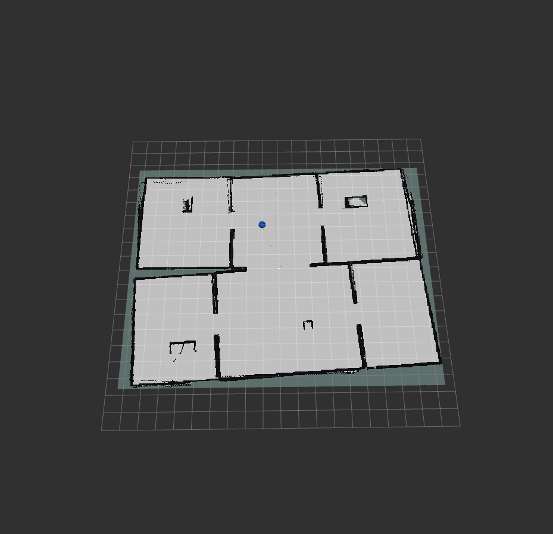

# Virtual Indoor Navigation

[](https://github.com/YYJHO/ros2-slam-auto-nav/actions/workflows/preflight.yml)

基于 **ROS 2 Humble + Gazebo Classic + slam_toolbox + Nav2** 的虚拟室内建图与房间导航项目。项目提供一个可直接运行的室内仿真环境，支持机器人建图、保存地图、房间命名、自动识别房间、按房间名称导航和图形化控制中心。



## 功能特点

- Gazebo 多房间室内仿真世界
- 差速移动机器人模型，包含 2D LiDAR、IMU、轮式里程计
- `slam_toolbox` 在线建图
- `Nav2` 室内路径规划与避障导航
- 可视化控制中心，集成建图、保存地图、导航、房间管理和诊断包导出
- 支持手动房间命名、地图点击命名、自动识别房间
- 支持按房间名称导航和自动巡航所有房间

## 项目结构

```text
release-virtual-indoor-nav/
├── README.md
├── INSTALL.md
├── image.png
├── runtime/
│   └── maps/                  # 运行后保存地图
├── scripts/                   # 常用启动、构建、检查脚本
└── workspace/
    └── src/
        └── virtual_indoor_nav/
            ├── config/        # SLAM / Nav2 / EKF 参数
            ├── launch/        # ROS 2 launch 文件
            ├── rviz/          # RViz 配置
            ├── urdf/          # 机器人模型
            ├── worlds/        # Gazebo 世界
            └── virtual_indoor_nav/ # Python 节点源码
```

## 环境要求

推荐环境：

- Ubuntu 22.04
- ROS 2 Humble
- Gazebo Classic
- Python 3.10

> 当前版本面向 Ubuntu 22.04 + ROS 2 Humble。其他发行版或 ROS 版本可能需要调整依赖包名和 launch 参数。

主要依赖：

- `nav2_bringup`
- `slam_toolbox`
- `robot_localization`
- `gazebo_ros_pkgs`
- `rviz2`
- `python3-pil`、`python3-pil.imagetk`

## 快速开始

克隆项目后进入仓库目录：

```bash
git clone https://github.com/YYJHO/ros2-slam-auto-nav.git
cd ros2-slam-auto-nav
```

安装依赖：

```bash
bash scripts/install_dependencies.sh
```

检查环境：

```bash
bash scripts/check_system.sh
```

编译工作区：

```bash
bash scripts/build_workspace.sh
```

启动图形化控制中心：

```bash
bash scripts/run_control_center.sh
```

## 推荐使用流程


在控制中心中按下面顺序操作：

1. 点击 **清理 Gazebo**，避免旧进程影响启动。
2. 点击 **构建工作区**，确保代码已经编译。
3. 点击 **开始建图并自动探索**，启动 Gazebo、SLAM、Nav2 和自动探索。
4. 等待探索完成.
5. 点击 **保存地图**，地图会保存到 `runtime/maps/`。
6. 在地图预览上点击可通行区域，输入房间名称。
7. 在左侧区域列表选择目标，点击 **导航到选中区域（不重启）**。
8. 如需排查问题，点击 **导出诊断包**。


## 命令行运行

如果不使用控制中心，也可以用脚本手动运行。

清理旧进程：

```bash
bash scripts/cleanup_gazebo.sh
```

启动建图：

```bash
bash scripts/run_mapping.sh
```

另开终端启动键盘控制：

```bash
bash scripts/run_wsad_teleop.sh
```

保存地图：

```bash
bash scripts/save_map.sh
```

启动导航：

```bash
bash scripts/run_navigation.sh
```

## 房间命令

房间导航节点订阅 `/room_command`，发布 `/room_status`。项目提供了脚本封装：

```bash
bash scripts/send_room_command.sh "save 客厅"
bash scripts/send_room_command.sh "goto 客厅"
bash scripts/send_room_command.sh "list"
bash scripts/send_room_command.sh "delete 客厅"
bash scripts/send_room_command.sh "auto_rooms"
bash scripts/send_room_command.sh "explore_rooms"
bash scripts/send_room_command.sh "cancel"
```

常用命令说明：

- `save <名称>`：保存机器人当前位置为房间点
- `goto <名称>`：导航到指定房间
- `delete <名称>`：删除房间点
- `set <名称> <x> <y> [yaw]`：保存指定地图坐标为房间点
- `rename <旧名> <新名>`：重命名房间
- `auto_rooms`：根据当前地图自动识别房间
- `explore_rooms`：按房间顺序自动巡航
- `cancel`：取消当前导航

## 运行数据

运行时生成的数据默认放在仓库内：

```text
runtime/maps/generated_map.yaml
runtime/maps/generated_map.pgm
runtime/rooms.yaml
runtime/diagnostics/
```

这些文件属于本地运行数据，默认不会提交到 GitHub。

## 图片放置说明

如果你想在 README 中展示更多截图，建议放到：

```text
docs/images/
```

然后在 README 中引用：

```md


```

图片文件名建议使用英文和短横线，避免空格和中文文件名。

## 详细文档

- [安装与操作手册](INSTALL.md)
- [建图排查说明](MAPPING_TROUBLESHOOTING.md)
- [系统架构说明](docs/ARCHITECTURE.md)
- [探索建图修改记录](EXPLORATION_CHANGES.md)
- [GitHub 发布清单](docs/GITHUB_RELEASE.md)

## 说明

当前项目主要面向虚拟仿真环境，重点验证上层导航链路：建图、定位、路径规划、房间目标管理和控制中心工作流。如果后续迁移到真实机器人，建议保留 ROS 2 上层导航结构，再替换机器人模型、传感器配置和底层运动控制接口。

## 发布到 GitHub

发布前建议先运行：

```bash
bash scripts/preflight_release.sh
```

详细发布检查清单见 [GitHub 发布清单](docs/GITHUB_RELEASE.md)。
